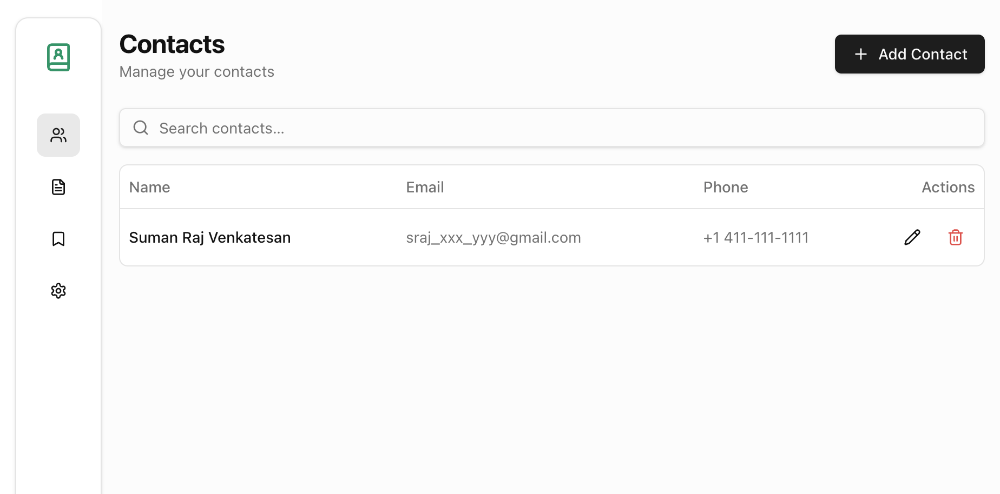
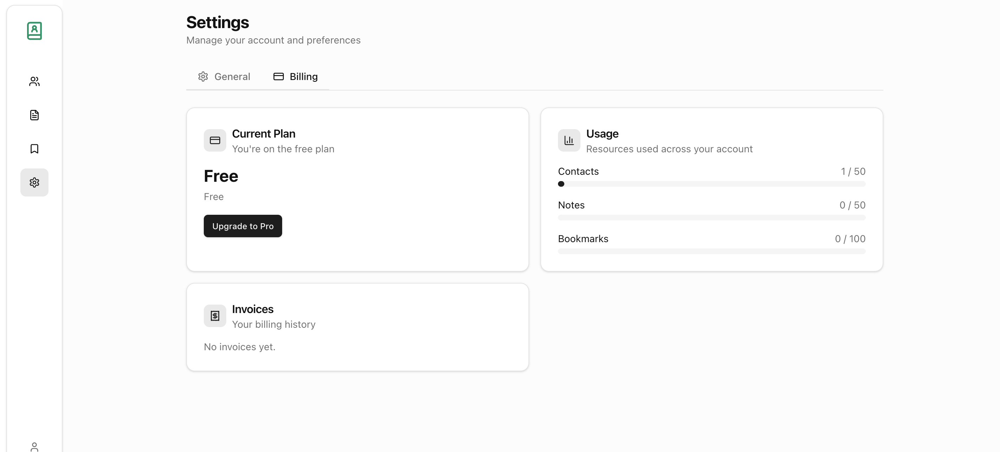
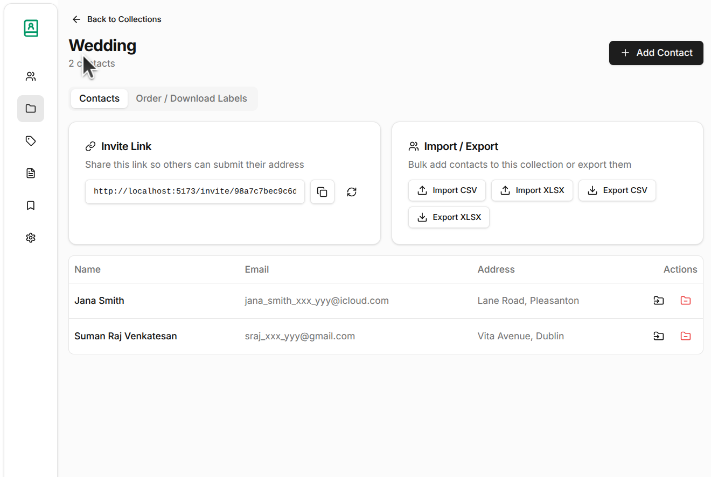

# Address Book

Full-stack address book SaaS — contacts, collections with invite links, printable/orderable address labels (Avery formats), CSV/XLSX import-export, notes, bookmarks, authentication, billing (Stripe), and an admin panel. Go backend (kern + xdb) with a React/TypeScript frontend.





## Features

- **Contacts** — CRUD with search, pagination, and quota limits
- **Collections** — organize contacts into groups, each with a shareable invite link so others can submit their address directly
- **Move / remove** — reassign contacts between collections from the contacts list or the collection page
- **Address labels** — print-yourself sheets or Stripe-ordered printed labels for Avery **5160 (default), 8160, 5162, 5163, 6871**
- **Import / Export** — CSV and XLSX, optionally scoped to a collection
- Notes, bookmarks, profile/preferences, billing (Stripe), admin panel

## Stack

- **Backend**: Go 1.26, [kern](https://github.com/mobentum/kern) framework + extensions (xconfig, xlog, xotel, xvalidator), [xdb](https://github.com/mobentum/xdb) ORM, SQLite (dev) or PostgreSQL (prod)
- **Frontend**: React 19 + TypeScript, Vite 6, Tailwind CSS 4, Zustand, React Hook Form + Zod, Radix UI
- **Infra**: Docker Compose, GitHub Actions CI, OpenObserve + Fluent Bit + postgres-exporter (optional observability)

## API Overview

The public API is grouped under `/api/v1`:

| Area        | Endpoints                                                                 |
|-------------|---------------------------------------------------------------------------|
| Auth        | `POST /auth/register`, `/auth/login`, `/auth/logout`, `GET /auth/me`      |
| Contacts    | `GET/POST /contacts`, `GET/PUT/DELETE /contacts/:id`, search, import/export |
| Collections | CRUD under `/collections`, invite tokens, `POST /collections/:id/contacts`, `PUT/DELETE /collections/:id/contacts/:contactId` (move/remove) |
| Labels      | `GET /labels/sheet?collection_id=&format=`, `POST /labels/order`, `GET /labels/orders`, `GET /labels/formats` |
| Billing     | plans, checkout, portal, webhooks, invoices                                |
| Admin       | users, plans, Stripe sync                                                  |

## Quick Start

```bash
# 1. Install dependencies
make web-install

# 2. Database + server (no logging stack)
make dev-lite

# 3. Full stack with observability (OpenObserve + Fluent Bit + postgres-exporter)
make dev
```

In a second terminal, start the frontend:

```bash
make web
```

Open the app at http://localhost:5173 (Vite) / http://localhost:8080 (API).

## Makefile targets

| Target                  | Description                                            |
|-------------------------|--------------------------------------------------------|
| `make dev`              | Full stack: db + logging stack + server                |
| `make dev-lite`         | db + server (no logging stack)                         |
| `make server`           | Run the Go backend (port 8080)                         |
| `make web`              | Install deps + start Vite dev server (port 5173)       |
| `make db`               | Start postgres via docker-compose                      |
| `make setup`            | Migrate + seed (cold start)                            |
| `make compose-logging`  | Start logging stack only                               |
| `make compose-logging-down` | Stop logging stack (keeps data volumes)            |
| `make docker`           | Build the Docker image                                 |
| `make clean`            | Remove build artifacts                                 |

## Configuration

Copy `.env.example` to `.env` and set values. All config is loaded via environment variables:

| Variable                | Default                                    | Description                          |
|-------------------------|--------------------------------------------|--------------------------------------|
| `DATABASE_DRIVER`       | `sqlite3`                                  | `sqlite3` or `postgres`              |
| `DATABASE_PATH`         | `kern-addressbook.db`                      | SQLite file or Postgres DSN          |
| `ADDR`                  | `:8080`                                    | HTTP listen address                  |
| `JWT_SECRET`            | dev default                                | JWT signing secret (change in prod)  |
| `SECURE_COOKIE`         | `false`                                    | Set `true` for `Secure` cookies      |
| `CORS_ORIGINS`          | `http://localhost:5173,http://localhost:3000` | Allowed CORS origins             |
| `STRIPE_SECRET_KEY`     | empty                                      | Stripe API key (billing)             |
| `STRIPE_WEBHOOK_SECRET` | empty                                      | Stripe webhook signing secret        |
| `LABEL_PRICE_CENTS`     | `150`                                      | Price per printed label sheet (minor units) |
| `LABEL_CURRENCY`        | `usd`                                      | Currency for label orders            |
| `LABEL_LABELS_PER_SHEET`| `30`                                       | Default labels per sheet             |
| `OTLP_ENDPOINT`         | `localhost:4318`                           | OpenTelemetry OTLP endpoint          |
| `MAIL_PROVIDER` / `MAIL_API_KEY` | empty                              | Email sending (optional)             |

The `.env` file is optional — missing it is fine in Docker/production.

## Observability Stack (optional)

A single-collector observability stack for development lives in `resources/logging/`:

```
Docker logs ──→ fluentd driver ──→┐
PG metrics ───→ postgres-exporter ─┤→ Fluent Bit ──→ OpenObserve ←── browser :5080
Traces (xotel) ────────────────────┘
```

- **OpenObserve** (http://localhost:5080) — unified logs, metrics, and traces with a built-in UI. Default login: `admin@example.com` / `Admin@12345` (from `docker-compose.logging.yml`).
- **Fluent Bit** — single collector handling all three signals:
  - **Logs**: Docker fluentd driver → `forward` input (:24224) → `es` output → OO `/_bulk`
  - **Metrics**: `prometheus_scrape` (postgres-exporter :9187) → `prometheus_remote_write` → OO
  - **Traces**: server `xotel` → OTLP HTTP (:4318) → `opentelemetry` output → OO `/v1/traces`
- **postgres-exporter** — exposes Postgres metrics for scraping.

### Start / stop

```bash
make compose-logging          # start logging stack
make compose-logging-down     # stop (keeps data volumes)

# Or merge with the app:
docker compose -f docker-compose.yml -f resources/logging/docker-compose.logging.yml up -d
```

### Run the server against it

```bash
./build/server   # or: make server
```

The server's access logs, application logs, and request traces all flow into OpenObserve automatically via the `OTLP_ENDPOINT` (default `localhost:4318`).

### Query examples in OpenObserve

- **Logs**: select the `default` stream — search `log_type="access"` for access logs, or filter by `container_name="/kern-addressbook-xdb-postgres-1"`
- **Metrics**: PromQL — `pg_locks_count`, `pg_stat_activity_count` (Postgres); `go_goroutines`, `go_memstats_heap_alloc_bytes`, `process_cpu_seconds_total` (Go runtime)
- **Traces**: trace search view — spans from `service.name = "addressbook"`

### Go app metrics

The server exposes Go runtime + process metrics at `GET /api/metrics` (Prometheus format) via `prometheus/client_golang`. Fluent Bit scrapes it alongside postgres-exporter, so both flow to OpenObserve:

- **`/api/metrics`** — heap, goroutines, GC, threads, process CPU (Prometheus scrape, Option A)
- **xotel OTLP metrics** — when `OTLP_ENDPOINT` is set, `xotel.Setup` also configures a MeterProvider with Go runtime metrics sent over OTLP (`/v1/metrics`), sharing the trace pipeline (Option B)

### Dashboard

A pre-built OpenObserve dashboard is bundled at `resources/logging/dashboards/addressbook.json` with tabs for **Go Server** and **Postgres** metrics. Provision it after starting the stack:

```bash
resources/logging/dashboards/install-dashboard.sh
# or: make dashboard-install
```

> Note: OpenObserve search time ranges are in **microseconds**. Trace data flushes from WAL to searchable Parquet on a delay (~minutes) in local mode.

## Architecture

DDD-inspired hexagonal layout per bounded context (`domain/`, `application/`, `infrastructure/`, `interfaces/`):

```
cmd/server/        entrypoint — middleware stack + route registration
cmd/admin/         admin CLI — migrate, seed, setup
internal/app/      composition root
internal/auth/     identity, JWT, passwords
internal/billing/  Stripe plans, subscriptions, webhooks
internal/features/ contact | note | bookmark | collection | label
internal/admin/    admin panel services
internal/shared/   db, middleware, response helpers, search interface
migrations/        sqlite/ + postgres/ driver-specific SQL
web/               React SPA
resources/logging/ optional OpenObserve observability stack
```

## Testing

```bash
go test ./...      # backend
go vet ./...       # static analysis
cd web && npm run build   # frontend type-check + build
```

## Docker

```bash
make docker          # build image
make docker-release  # tag with git describe
docker compose up -d postgres   # just the DB
```
